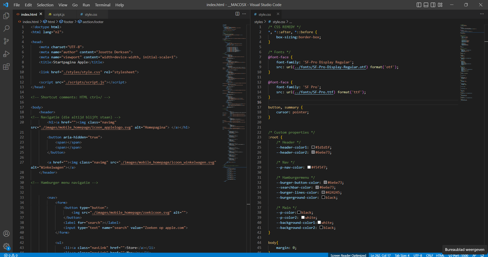
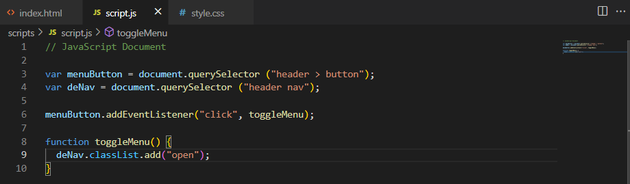

# Procesverslag
Markdown is een simpele manier om HTML te schrijven.  
Markdown cheat cheet: [Hulp bij het schrijven van Markdown](https://github.com/adam-p/markdown-here/wiki/Markdown-Cheatsheet).

Nb. De standaardstructuur en de spartaanse opmaak van de README.md zijn helemaal prima. Het gaat om de inhoud van je procesverslag. Besteedt de tijd voor pracht en praal aan je website.

Nb. Door *open* toe te voegen aan een *details* element kun je deze standaard open zetten. Fijn om dat steeds voor de relevante stuk(ken) te doen.

## Jij

  
uitwerken voor kick-off werkgroep

  ### Auteur:
  Josette Derksen 

  #### Je startniveau:
  Blauw

  #### Je focus:
  Surface plane
 

## Je website

  
uitwerken voor kick-off werkgroep

  ### Je opdracht:
  https://www.apple.com/nl/

  #### Screenshot(s) van de eerste pagina (small screen): 
  Homepagina 
  

  #### Screenshot(s) van de tweede pagina (small screen):
  Support
  

## Toegankelijkheidstest 1/2 (week 1)

  
uitwerken na test in 1e werkgroep

  ### Bevindingen
  Lijst met je bevindingen die in de test naar voren kwamen:

  #### Screenreader
  Problemen Windows niveau
  - Je moet al heel veel shortcuts weten voordat je er handig gebruik van kan maken.
  - Zegt heel vaak 'koppeling'.
  - Kan niet typen als de verteller aanstaat.
  
  Goed van Apple
    - Er wordt wel gebruikt gemaakt van kopjes en linkjes. 
   
  Problemen Apple 
 - [x] Er wordt gebruikt gemaakt van heel veel divjes.
 - [x] Weinig onderbouwende tekst in de code zelf zoals een alt-tekst.   
 - [x] Hamburgerbutton wordt voorgelezen als: 'Apple knop global nav open menu'.
 - [ ] Spreekt Engelse woorden heel Nederlands uit waardoor het niet altijd duidelijk is.

Op te lossen door
    -Minder divjes te gebruiken en meer gebruik te maken van de echte elementen.
    - Code betere alt en aria tekst geven.
    - Hamburgermenu een kortere naam geven.
    - < html lang="en" > achter de engelse woorden te zetten.
 

 Sommige punten zitten meer op Windows niveau dan op Apple niveau, zoals de shortcuts, het niet kunnen typen en dat Engelse woorden op een Nederlandse manier worden uitsproken. Op andere punten kan ik wel wat veranderen zoals dat er veel gebruikt wordt gemaakt van divjes inplaats van de juiste elementen en onderbouwende teksten toevoegen die screenreader kunnen voorlezen zodat een blind iemand weet wat er op een afbeelding staat. 

  #### Muis en Toetsenbord 
  Problemen Windows niveau
  - Veel shortcuts maar opzich makkelijk te vinden. 
  
   Goed van Apple
  - Hover over links werkt. Komt een blauwe streep onder te staan. 
  - Muis veranderd in een handje op de klikbare plekken. 
  - Kan door de carousel scrollen met m'n pijltjes toetsen. 

  #### Motoriek (shocks, elastiekjes)
  - Met het trilding om parkinson na te bootsen was het vreselijk moeilijk om te typen. Typt snel dubbele letters. 

  #### Visueel (brillen, contrast, kleurenblind, dark/light). 
  Goed van Apple
    - Contrast op de rest van de website best goed. Veel gebruik gemaakt van zwart-wit. 

Problemen Apple
 - [x] Hover over navigatie zie je een klein beetje kleur verandering (van grijs naar wit) maar niet genoeg voor als je iets slechter kan zien.
  
  
  
  Op te lossen door:
  - Betere hover kleur. Streepje onder hover.  

## Breakdownschets (week 3)

  
uitwerken na afloop 3e werkgroep

  ### de hele pagina: 
  Homepagina
  

  
  Accessoires pagina
  

## Voortgang 1 (week 3)

  
uitwerken voor 1e voortgang

  ### Stand van zaken
  Hoewel ik de meeste code alweer was vergeten, helpen de oefeningen erg om het weer een beetje in de vingers te krijgen. Ik heb moeite om elementen zoals grid of flexbox te blijven snappen en de titels/namen (hoe noem je dat?) te onthouden. Bij de breakdownschetsen weet ik niet zeker of ik de juiste elementen op de goede plek heb gezet en in elkaar heb geimplementeerd. 
  Ik ben nog niet begonnen met het coderen van mijn eigen website naarmate we 2 dagen terug pas zijn begonnen met de breakdownschetsen. 
  

  ### Agenda voor meeting
  samen met je groepje opstellen

  | Arsen          | Randy          | Tim    | Josette        |
  | ---            | ---                | ---          | ---              |
  | Semantiek → klopt het dat bepaalde elementen onder secties vallen → zie schetsen.   | Hoe pak je het maken van een submenu aan? | Mag je bij onderstreepte woord een < u > element gebruiken?  | Kloppen mij breakdownschetsen?    |
  | In welke mate en op watvoor manier is het van belang dat wij rekening houden met toegankelijkheid voor gebruikers? | Wanneer is iets een section? | Mag je bij schuingedrukt woord een < em >, < i > element gebruiken? | De website veranderd af en toe, welke versie moet ik dan namaken? |
  | ...            | ...                | Zijn het meerdere klikbare afbeeldingen of radio buttons?         | ...              |

  ### Verslag van meeting

**< title > Startpagina Apple < /title >**
-   Consistent houden. Of eerst de pagina titel en dan de naam of andersom maar dit wel overal hetzelfde.

**Navigatie:**
-   Elementen die buiten het hamburgermenu blijven staan, maar wel bij de navigatie horen, krijgen hun eigen navigatie. Zo kan je het ene menu verbergen onder een button en de ander niet.
    
**Titels**
-   H1 kan op de startpagina ook een logo zijn of verborgen omdat er gewoon geen h1 is. Op de andere pagina’s is meestal wel een duidelijke h1
-   H1 is belangrijk voor google resultaten.
-   H2 moet altijd voor de h3 etc. In de CSS kan de volgorde worden aangepast.

**Img**
-   Als img als decoratie wordt gebruikt moet de alt worden leeg gelaten of de afbeelding moet via css worden ingevoegd.

**Links/buttons**
-   Links gaan naar andere pagina.
-   Buttons blijven op dezelfde pagina, voeren een actie uit. Bijv. hamburger menu in- en uitvouwen is een button.
-   Veel website laten links zien als buttons.
-   Onderscheid is belangrijk voor screenreaders. Zo kan je deze alle linkjes of alle formulieren laten afgaan, maar dan moet wel duidelijk zijn wat wat is.

**Talen**

-   Engelse woorden (of van andere talen) op een Nederlandse site, kun je voorzien van een span en een lang attribute.

## Voortgang 2 (week 7)

  
uitwerken voor 2e voortgang

  ### Stand van zaken
 Ik kwam een beetje laat op gang, omdat ik niet wist waar ik moest beginnen, maar langzaam komt het bij elkaar. 
  
  
  
  
  
  
  

  ### Agenda voor meeting
  samen met je groepje opstellen

  | Randy      | Josette          | Arsen    | Tim en Redouane        | 
  | ---            | ---                | ---          | ---              |
  | Hoe kun je het verticaal positioneren van een list-style-image het besten aanpakken?  | Waarom werkt mijn hamburgermenu niet?           | en ik dit    | en dan ik dat    |
  | Hoe verberg je zelfgemaakte semantische kopjes? | Hoe komt het dat alles in mijn header te hoog staat terwijl ik het heb gecentreerd? | nog een punt | dit wil ik zeker |
  | Hoe schrijf je een zin waarin sommige woorden random wel of geen hoofdletters hebben?        | Hoe kan een afbeelding buiten beeld vallen zonder dat het beeld breder wordt?                | ...          | ...              |
  | Als Header, footer gezamenlijke kleur bij general styling plaatsen (DRY) of beter ieder bij eigen selector declareren?          | Kan ik een span gebruiken voor het hamburgermenu?               | ...          | ...              |
  | Hoe kan ik mijn CSS beter indelen?         | Op de Apple website zijn de categorieën in het hamburger menu background afbeeldingen. Kan ik dit beter tekst laten?              | ...          | ...              |
| ...            | Zijn de afbeeldingen decoratief of niet?               | ...          | ...              |
| ...          | Is de footer ook een nav of niet en moeten de uitklapmenu’s werken?             |

  ### Verslag van meeting
  - Javascript moet in de html helemaal onderaan.
  - Je kan meerdere navs hebben op 1 pagina (ook footer).
  - Span als streepjes voor het hamburgermenu mag. 
  - Header: display: flex
		        justify-content: space-between
		        align-items: center. 
  - Tip: HTML character check doen om verschillende karakters te weergeven in de html. Zoals ☺ ♦♣◘○♠♥☻ ect. 

## Toegankelijkheidstest 2/2 (week 8)

  
uitwerken na test in 8e werkgroep

  ### Bevindingen
  
  #### Screenreader
 - [x] Veel afbeeldingen zijn 'img' zonder verdere beschrijving zoals het Apple logo. 
 - [x] Hamburgermenu knop is nu gewoon 'knop'.

  Kan opgelost worden door:
  - Alt teksten en aria-labels toe te voegen.

  #### Muis en Toetsenbord 
  
 - [ ] Slaat de 'zoekimg' over. 
 - [ ] Selecteerd ook de rest van de pagina als het hamburgermenu open staat. 

  Kan opgelost worden door: 
  - Volgorde nav aan te passen?

  #### Visueel (brillen, contrast, kleurenblind, dark/light). 
  

 - [x] Link kleur is slecht (donker paars).
 - [x] Linkjes staan op afbeeldingen dit maakt het moeilijk te lezen.
 - [x] Knoppen en linkjes hebben nog geen states.

  Kan opgelost worden door:
  - Plaatjes kleiner te maken (vooral op dekstop).
  - Streep onder de linkjes te laten verschijnen als je hovert.
  - Kleur van de linkjes blauw maken.
  - Knoppen en linkjes states geven. 

  #### Motoriek (shocks, elastiekjes)
  Hier korte omschrijving (met indien nodig afbeeldingen)

  Hier een omschrijving van hoe het opgelost kan worden (met indien nodig afbeeldingen)

## Voortgang 3 (week 7)

  ### Stand van zaken
  Had in de vakantie meer willen doen, maar heb daar de tijd niet voor genomen. Nu voor mijn gevoel het makkelijkste is geweest vind ik het moeilijker om het leuk te vinden. Ik hou van direct resultaat en dat gaat met code vaak niet hahaha... 

  ### Agenda voor meeting

  | Josette      | Tim          | Arsen    | Randy        |
  | ---            | ---                | ---          | ---              |
  | Hoe krijg ik de linkjes “meer informatie” en “koop” naast elkaar?  | Hoe kan ik een video (iframe) responsive maken, maar wel een 16:9 ratio behouden?            |     | Mijn footer is niet meer te zien.    |
  | Waarom komt mijn menu niet over de breedte als ik het scherm groot maak? | Uitleggen hoe radio button in eigen stijl te werk gaat. | nog een punt | dit wil ik zeker |
  | Carousel / slideshow….           | Hoe tekst veranderen wanneer je met je muis (hover) over een radio button heen gaat?               | ...          | ...              |
  | Mijn footer is niet meer te zien           | Kun je de volgorde wijzigen (order) zonder gebruikt te maken van een flex of grid?                | ... 
  | Mag ik de grote animatie vervangen voor wat er nu op de website staat?          | ...                | ...         

  ### Verslag van meeting
  
Placeholder Label
  

search

-   Enkel alles naast elkaar = flex.
    
-   Enkel alles onder elkaar = grid.

## Eindgesprek (week 5)

  
uitwerken voor eindgesprek

  ### Je uitkomst - karakteristiek screenshots:
  

  ### Dit ging goed/Heb ik geleerd: 
  Ik heb twee pagina's gecodeert woehoe!! 
  Maar buiten dat heb ik meer geleerd dan ik had kunnen denken. Ik had het idee dat ik code weer vanaf het begin zou moeten leren, niet alleen wat we voor dit vak moesten doen maar de gehele basis.

  Ik heb veel geofend met flex en grid:
  

  Gespeeld met animaties:
  

  Deze prachtige buttons weergegeven met een box-shadow:
  

  Verschillende states toegepast:
  

  Hamburgermenu met javascript werkt!:
  

  En de footer trouwens ook:
  

  ### Dit was lastig/Is niet gelukt:
  'Zoek naar onderwerpen' in support heeft een zoekbalk en blijft blauw omrand met een label bovenin als er iets is ingevoerd. Ik had wel even gekeken, maar kreeg de label niet goed tijdens het schalen van de pagina. Daarnaast bleef het uiteindelijk wel staan als er iets was ingevoerd, maar toen ging het niet meer uit. Het was geen prioriteit dus ik heb het maar laten gaan.
  Mijn zoekbalk:
  Apple's zoekbalk: 

  'Support aanvragen' in Support heeft een afbeelding. Ik heb precies dezelfde afbeelding genomen als Apple, maar op mobiel ziet hij er anders uit bij hen dan bij mij. Op desktop bestaat dit probleem niet? Ik snap er niks van. 
  Mijn afbeelding: 
  Apple's afbeelding: 

  De screen reader leest bij de header navigatie op desktop nog steeds het winkelmantje als 2e terwijl er een hele navigatie tussen zit. Waarschijnlijk komt het omdat 1: op mobiel staan het logo en winkelwagentje naast elkaar. En 2: omdat de categorieën nav zijn eigen container heeft waar het wagentje en logo buiten vallen. Maar ik weet het niet zeker.

  De carousel heeft Sanne voor me gemaakt. Daar bakte ik niet veel van. Hij is erg ingewikkelt. De code is wel te begrijpen met pijn en moeite, maar ongelovelijk veel. Dank je wel!! 

## Bronnenlijst

  
continu bijhouden terwijl je werkt

  Nb. Wees specifiek ('css-tricks' als bron is bijv. niet specifiek genoeg).

  1. https://codepen.io/shooft/pens/public Voornamelijk Sanne's codepens.
  2. https://www.apple.com/nl/ Ik een stukjes code overgenomen (de header blur).
  3. ...

